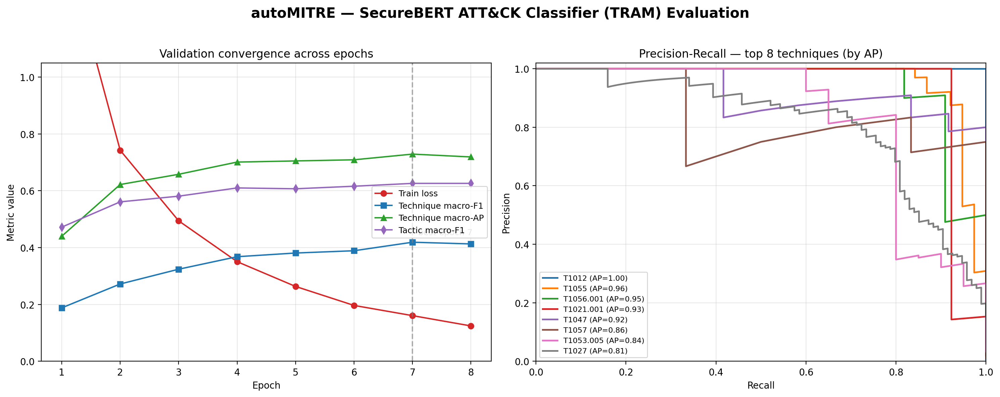

# Model Performance Report — SecureBERT ATT&CK Classifier (TRAM)

_Auto-generated by `scripts/generate_evaluation_report.py` from the training `--save-pr` artifacts. Do not edit by hand._

## Headline metrics (best checkpoint)

Selected by highest technique macro-F1 (epoch **7**):

| Metric | Value |
|---|---|
| Technique macro-F1 | **0.419** |
| Technique macro-AP (PR-AUC) | **0.729** |
| Tactic macro-F1 | **0.626** |
| Train loss @ best epoch | 0.161 |

## Dataset

CTID TRAM corpus (multi-label, sentence-level CTI):

| Split | Count |
|---|---|
| Total samples | 4036 |
| Train | 3431 |
| Validation | 605 |
| Tactics | 14 |
| Techniques (incl. 24 sub-techniques) | 74 |

## Evaluation chart

## Per-epoch validation metrics

| Epoch | Train loss | Tactic macro-F1 | Technique macro-F1 | Technique macro-AP |
|---:|---:|---:|---:|---:|
| 1 | 1.504 | 0.472 | 0.188 | 0.440 |
| 2 | 0.743 | 0.561 | 0.272 | 0.622 |
| 3 | 0.494 | 0.581 | 0.324 | 0.658 |
| 4 | 0.351 | 0.610 | 0.368 | 0.701 |
| 5 | 0.263 | 0.607 | 0.381 | 0.705 |
| 6 | 0.197 | 0.616 | 0.389 | 0.709 |
| 7 ⭐ | 0.161 | 0.626 | 0.419 | 0.729 |
| 8 | 0.124 | 0.626 | 0.413 | 0.719 |

## Per-technique average precision (PR artifact)

From `pr_curves.json` (top-20 labels by support, final epoch). Mean AP across these labels: **0.707**.

| Technique | Average Precision |
|---|---:|
| T1012 | 1.000 |
| T1055 | 0.961 |
| T1056.001 | 0.946 |
| T1021.001 | 0.935 |
| T1047 | 0.923 |
| T1057 | 0.856 |
| T1053.005 | 0.838 |
| T1027 | 0.812 |
| T1033 | 0.793 |
| T1059.003 | 0.781 |
| T1070.004 | 0.780 |
| T1003.001 | 0.772 |
| T1016 | 0.769 |
| T1071.001 | 0.716 |
| T1041 | 0.660 |
| T1068 | 0.500 |
| T1036.005 | 0.481 |
| T1074.001 | 0.314 |
| T1005 | 0.286 |
| T1072 | 0.009 |

## Methodology notes

- **Architecture:** SecureBERT (RoBERTa-based) twin-head multi-label classifier (tactics + techniques) with a hierarchical-consistency loss (child probability ≤ parent probability).
- **Acceptance gate at inference:** `model_probability ≥ 0.50` AND `bi_encoder_support ≥ 0.40` (a cross-encoder stage was dropped as it under-scored CTI-vs-definition pairs).
- **Imbalance handling:** per-label `pos_weight = negatives/positives` in the BCE terms; macro-F1 and macro Average-Precision (PR-AUC) are the headline metrics for this long-tailed label space.
- **Hardware:** fine-tuned natively on Apple-Silicon MPS (`--batch-size 4 --max-len 128`, watermark lifted) on an 8 GB M1.
